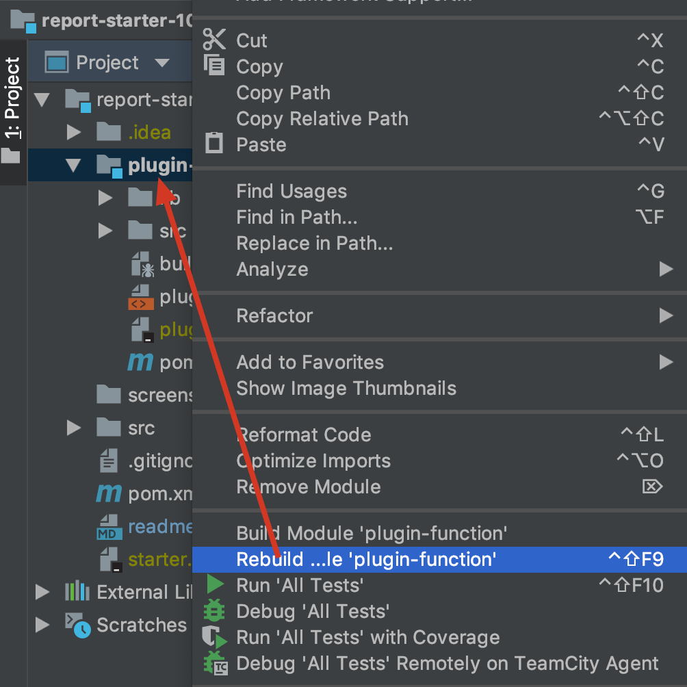

# 工程配置指南

## 安装maven
用于构建开发工程，文档参考：http://wiki.jikexueyuan.com/project/maven/environment-setup.html

## 安装ant
用于构建插件安装包，文档参考：http://wiki.jikexueyuan.com/project/ant/environment-setup.html

## 配置开发工程
直接使用IntelliJ IDEA打开这个目录即可。

如果需要复制jar包到webroot/WEB-INF/lib下，可以执行命令：```mvn install```

**注意：**该工程依赖的jar为私有maven服务器，注意不要删除pom.xml中的repositories。

## 启动应用程序

### 复制插件配置

* 将plugin.xml文件复制到webroot/WEB-INF/plugins/plugin-xyz-1.0目录下，其中xyz一般用插件id表示。
* 在开发工具内部，手动编译插件class文件到插件目录，注意可能需要修改插件的pom.xml的文件


### 启动设计器
如果希望正常的进行插件开发，使用```com.fr.learn.Leaner```启动设计器。

如果希望进行设计器调试，则使用```com.fr.learn.Leaner4Debug```启动设计器。

### 选择报表运行环境
一般情况启动设计器的时候，会自动使用上一次使用的报表运行环境，我们这里需要新建一个本地报表运行环境，并指向这个开发目录下的webroot/WEB-INF目录。


## 修改依赖的jar版本
只需要更改pom.xml中的common-version属性即可。

|common-version|含义|
|--------------|----|
|10.0-RELEASE-SNAPSHOT|10.0的测试版本快照|
|10.0-SNAPSHOT|10.0的正式版本快照|
|10.0|10.0的正式版本|